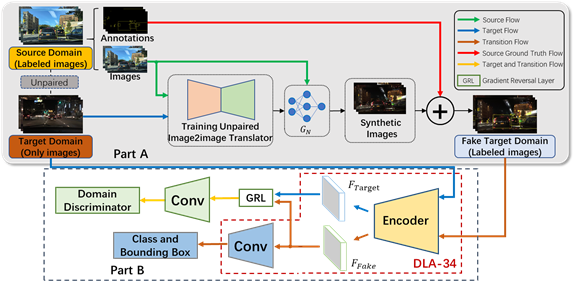
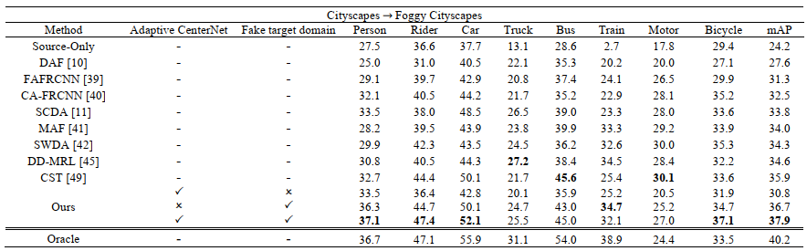
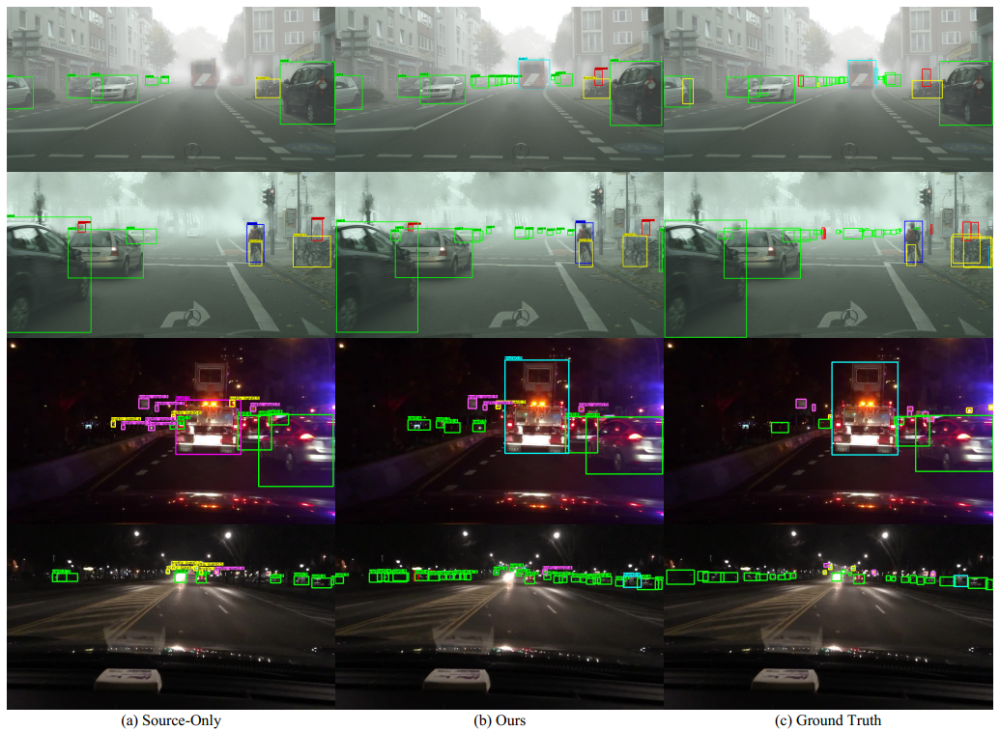

# SDA-OD

## Approaches
<div align=center></div>
Domain shift is addressed in two steps. In the first step, to bridge the domain gap, an unpaired image-to-image translator is trained to construct a fake target domain by translating the source images to the similar ones in the target domain. In the second step, an adaptive CenterNet is designed to align distributions at the feature level in an adversarial learning manner.

---

## How to use code
Please refer to [INSTALL.md](https://github.com/xingyizhou/CenterNet/blob/master/readme/INSTALL.md) for installation instructions.

### Datasets
You can download dataset from: [Cityscapes and Foggy Cityscapes](https://www.cityscapes-dataset.com/downloads/)、[BDD100K](https://bdd-data.berkeley.edu/)、[sim10k](https://fcav.engin.umich.edu/projects/driving-in-the-matrix)


After downloading, the folder structure for our experiments should look like this:
</div>

### Training
#### Step 1: CycleGAN
The source code used for the CycleGAN model was made publicly available by [here](https://github.com/aitorzip/PyTorch-CycleGAN).
#### Step 2: Adaptive CenterNet
Below script gives you an example of training a model with [pre-trained model](https://drive.google.com/file/d/1pl_-ael8wERdUREEnaIfqOV_VF2bEVRT/view).
```
python main.py ctdet --source_dataset fake_cityscapes --target_dataset foggy_cityscapes --exp_id grl_C2F --batch_size 32 --data_dir /root/dataset/ --load_model ./pre-trained-model/ctdet_coco_dla_2x.pth
```
---

### Evaluation
Our proposed method is evaluated in domain shift scenarios based on the driving datasets. 
#### Example: Clear-to-Haze Adaptation Scenario
You can download the [checkpoint](https://drive.google.com/file/d/1bbtUnB7vi5p3cpX2Mf0iz_ploj2Omxdv/view?usp=sharing) and do prediction or evaluation.
```
python test.py ctdet --exp_id checkout --source_dataset foggy_cityscapes --not_prefetch_test --data_dir /root/dataset/ --load_model ./sda_save.pth
```
The results show that our method is superior to the state-of-the-art methods and is effective for object detection in domain shift scenarios.
<div align=center></div>

---
### Prediction
The image detection results can be viewed with the following commands.
```
python demo.py ctdet --demo ./images --load_model ./sda_save.pth
```
<div align=center></div>

---

